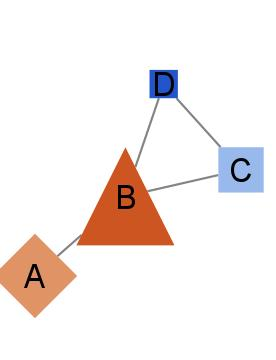

```{r}
library(RCy3)

```

1) Checking whether the script can connect to Cytoscape (.exe) installed on the laptop
```{r}
cytoscapePing()
cytoscapeVersionInfo ()
```

2) Generating a network
```{r}
nodes <- data.frame(id=c("node 0","node 1","node 2","node 3"),
           group=c("A","A","B","B"), # categorical strings
           score=as.integer(c(20,10,15,5)), # integers
           stringsAsFactors=FALSE)
edges <- data.frame(source=c("node 0","node 0","node 0","node 2"),
           target=c("node 1","node 2","node 3","node 3"),
           interaction=c("inhibits","interacts","activates","interacts"),  # optional
           weight=c(5.1,3.0,5.2,9.9), # numeric
           stringsAsFactors=FALSE)

createNetworkFromDataFrames(nodes,edges, title="my first network", collection="DataFrame Example")
```
 
3) Changing the style of the network

  a) Changing the style to 'Marquee'
```{r}
setVisualStyle('Marquee')
```

 

  b) Changing to my own style
  
```{r}
style.name = "myStyle"
defaults <- list(NODE_SHAPE="diamond",
                 NODE_SIZE=30,
                 EDGE_TRANSPARENCY=120,
                 NODE_LABEL_POSITION="W,E,c,0.00,0.00")
nodeLabels <- mapVisualProperty('node label','id','p')
nodeFills <- mapVisualProperty('node fill color','group','d',c("A","B"), c("#FF9900","#66AAAA"))
arrowShapes <- mapVisualProperty('Edge Target Arrow Shape','interaction','d',c("activates","inhibits","interacts"),c("Arrow","T","None"))
edgeWidth <- mapVisualProperty('edge width','weight','p')

createVisualStyle(style.name, defaults, list(nodeLabels,nodeFills,arrowShapes,edgeWidth))
setVisualStyle(style.name)
```
 


```{r}
lockNodeDimensions(FALSE, style.name)
```

4) Adding node attributes

```{r}
 g = new ('graphNEL', edgemode='directed')
    g = graph::addNode ('A', g)
    g = graph::addNode ('D', g)
    g = graph::addNode ('C', g, edges = list('D'))
    g = graph::addNode ('B', g, edges = list(c('A','D','C')))
    createNetworkFromGraph (g, title='simple network', collection='GraphNEL Example')


df <- data.frame (moleculeType=c('kinase','TF','cytokine','cytokine'),                    log2fc=c(1.8,3.0,-1.2,-2.5),
row.names = c('A','B','C','D'), # row.names = node names
stringsAsFactors = FALSE)       # important when loading strings!
loadTableData (df)
    
    
    
    
    
    
setNodeShapeDefault ('OCTAGON')
setNodeColorDefault ('#AAFF88')
setNodeSizeDefault  (60)
setNodeFontSizeDefault (30)
```
 

```{r}

getNodeShapes ()   # diamond, ellipse, trapezoid, triangle, etc.
    column <- 'moleculeType'
    values <- c ('kinase',  'TF','cytokine')
    shapes <- c ('DIAMOND', 'TRIANGLE', 'RECTANGLE')
    setNodeShapeMapping (table.column=column, 
                         table.column.values=values,
                         shapes=shapes)
    
    column <- 'log2fc'
    control.points <- c (-3.0, 0.0, 3.0)
    colors <-  c ('#5588DD', '#FFFFFF', '#DD8855')
    setNodeColorMapping (column, control.points, colors)
```
 
 
 
 
```{r}

 control.points <- c (-2.0, 0.0, 2.0)
colors <-  c ('#2255CC', '#5588DD', '#FFFFFF', '#DD8855','#CC5522')
    setNodeColorMapping (column, control.points, colors)
```
 
 

```{r}
control.points = c (-3.0, 2.0, 3.0)
    sizes     = c (20, 80, 90)
    setNodeSizeMapping (column, control.points, sizes)
```

 
 6) Selecting nodes
```{r}
selectNodes ('C','name')
getSelectedNodes ()
```

 a) Show first neighbour of the nodes
 
```{r}
selectFirstNeighbors ()
```
 
 
```{r}
node.names <- getSelectedNodes ()
node.names
```
 
```{r}
 clearSelection()
  ?clearSelection
```
 
 7) Saving and export
 
  a) SAve everything
```{r}
 saveSession('vignette_session')
```
 
  b) Save high resolution iage files
  
```{r}
full.path=paste(getwd(),'vignette_image',sep='/')
    exportImage(full.path, 'PNG', zoom=200) #.png scaled by 200%
    exportImage(full.path, 'PDF') #.pdf
    ?exportImage
```
  
 