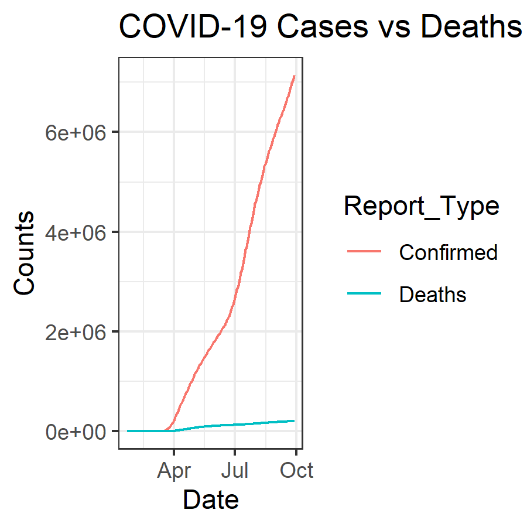

```{r, message=FALSE}
library(tidyverse)
library(lubridate)
library(plotly)
library(gganimate)
library(transformr)
```


# Data for the lab
```{r}
time_series_confirmed_long <- read_csv(url("https://raw.githubusercontent.com/CSSEGISandData/COVID-19/master/csse_covid_19_data/csse_covid_19_time_series/time_series_covid19_confirmed_global.csv")) %>%
  rename(Province_State = "Province/State", Country_Region = "Country/Region")  %>% 
               pivot_longer(-c(Province_State, Country_Region, Lat, Long),
                             names_to = "Date", values_to = "Confirmed") 
# Let's get the times series data for deaths
time_series_deaths_long <- read_csv(url("https://raw.githubusercontent.com/CSSEGISandData/COVID-19/master/csse_covid_19_data/csse_covid_19_time_series/time_series_covid19_deaths_global.csv")) %>%
  rename(Province_State = "Province/State", Country_Region = "Country/Region")  %>% 
  pivot_longer(-c(Province_State, Country_Region, Lat, Long),
               names_to = "Date", values_to = "Deaths")
# Create Keys 
time_series_confirmed_long <- time_series_confirmed_long %>% 
  unite(Key, Province_State, Country_Region, Date, sep = ".", remove = FALSE)
time_series_deaths_long <- time_series_deaths_long %>% 
  unite(Key, Province_State, Country_Region, Date, sep = ".") %>% 
  select(Key, Deaths)
# Join tables
time_series_long_joined <- full_join(time_series_confirmed_long,
    time_series_deaths_long, by = c("Key")) %>% 
    select(-Key)
# Reformat the data
time_series_long_joined$Date <- mdy(time_series_long_joined$Date)
# Create Report table with counts
time_series_long_joined_counts <- time_series_long_joined %>% 
  pivot_longer(-c(Province_State, Country_Region, Lat, Long, Date),
               names_to = "Report_Type", values_to = "Counts")
```

# Fine tunning ggplots

## Graphic Output

```{r}
# Plot graph to a pdf outputfile
pdf("images/time_series_example_plot.pdf", width=6, height=3)
time_series_long_joined %>% 
  group_by(Country_Region,Date) %>% 
  summarise_at(c("Confirmed", "Deaths"), sum) %>% 
  filter (Country_Region == "US") %>% 
    ggplot(aes(x = Date,  y = Deaths)) + 
    geom_point() +
    geom_line() +
    ggtitle("US COVID-19 Deaths")
dev.off()
```

```{r}
# Plot graph to a png outputfile
ppi <- 300
png("images/time_series_example_plot.png", width=6*ppi, height=6*ppi, res=ppi)
time_series_long_joined %>% 
  group_by(Country_Region,Date) %>% 
  summarise_at(c("Confirmed", "Deaths"), sum) %>% 
  filter (Country_Region == "US") %>% 
    ggplot(aes(x = Date,  y = Deaths)) + 
    geom_point() +
    geom_line() +
    ggtitle("US COVID-19 Deaths")
dev.off()
```


# RMarkdown loading images


## Interactive graphs

```{r, fig.align='center', fig.height=3, fig.width=5}

ggplotly(time_series_long_joined %>% 
    group_by(Country_Region,Date) %>% 
    summarise_at(c("Confirmed", "Deaths"), sum) %>% 
    filter (Country_Region == "US") %>% 
    ggplot(aes(x = Date,  y = Deaths)) + 
      geom_point() +
      geom_line() +
      ggtitle("US COVID-19 Deaths")
)
```

```{r, fig.align='center', fig.height=3, fig.width=5}
US_deaths <- time_series_long_joined %>% 
    group_by(Country_Region,Date) %>% 
    summarise_at(c("Confirmed", "Deaths"), sum) %>% 
    filter (Country_Region == "US")
 p <- ggplot(data = US_deaths, aes(x = Date,  y = Deaths)) + 
        geom_point() +
        geom_line() +
        ggtitle("US COVID-19 Deaths")
ggplotly(p)

```
## Animated Graphs with gganimate


```{r}

```


```{r}
theme_set(theme_bw())

data_time <- time_series_long_joined %>% 
    group_by(Country_Region,Date) %>% 
    summarise_at(c("Confirmed", "Deaths"), sum) %>% 
    filter (Country_Region %in% c("China","Korea, South","Japan","Italy","US")) 
p <- ggplot(data_time, aes(x = Date,  y = Confirmed, color = Country_Region)) + 
      geom_point() +
      geom_line() +
      ggtitle("Confirmed COVID-19 Cases") +
      geom_point(aes(group = seq_along(Date))) +
      transition_reveal(Date) 
# Some people needed to use this line instead
animate(p,renderer = gifski_renderer(), end_pause = 15)
#animate(p, end_pause = 15)
```

# **Exercises**

Challenge 1
Print a graph (different from the one above) to a png file using 3*ppi for the height and width and display the png file in the report using the above R Markdown format

```{r, results='hide'}
ppi <- 300
png("images/confirmed_vs_deaths_graph.png", width=3*ppi, height=3*ppi, res=ppi)
 time_series_long_joined_counts %>% 
  filter(Country_Region=="US") %>% 
  ggplot(aes(x=Date, y=Counts))+
  geom_line(aes(group=Report_Type, color=Report_Type))+
  labs(title = "COVID-19 Cases vs Deaths in US")
dev.off()


```



Challenge 2
Turn one of the exercises from Lab 5 into an interactive graph with plotyly

```{r,  fig.align='center'}
time_series_confirmed_US<-  read_csv(file="data/time_series_covid19_confirmed_US.csv")

us_confirmed_df <-time_series_confirmed_US %>%
  pivot_longer(cols = -c(colnames(time_series_confirmed_US)[1:11]), names_to="Date", values_to= "Confirmed") %>% 
  group_by(Province_State,Date) %>% 
  summarise("Total_Confirmed"= sum(Confirmed))

us_confirmed_df$Date <- mdy(us_confirmed_df$Date)
#datatable(us_confirmed_df)

my_plot<-us_confirmed_df %>% 
  ggplot(mapping=aes(x=Date, y=Total_Confirmed))+
  geom_line(aes(group=as.factor(Province_State), color=Province_State), size=1, show.legend = FALSE)+
  facet_wrap(~Province_State, ncol=4, scales = "free_y")+
  theme_classic()+
   theme(text= element_text(size=11, colour = 'black'),
        line = element_line(size = 1, colour = 'black'))


hide_legend(ggplotly(my_plot, width = 1000,
  height = 1500))
```


Challenge 3
Create an animated graph of your choosing using the time series data to display an aspect (e.g. states or countries) of the data that is important to you


```{r, fig.width=5, fig.height= 3, fig.align='center'}
Lat_plot_df <-time_series_long_joined%>% 
  group_by(Lat) %>% 
  summarise(sum_Confirmed= sum(Confirmed), sum_Death= sum(Deaths)) #%>% 
  #pivot_longer(cols = c(sum_Confirmed, sum_Death), names_to="Type", values_to="Number")

#Long_plot_df <-time_series_long_joined%>% 
#  group_by(Long) %>% 
#  summarise(sum_Confirmed= sum(Confirmed), sum_Death= sum(Deaths)) #%>% 
  #pivot_longer(cols = c(sum_Confirmed, sum_Death), names_to="Type", values_to="Number")

  Lat_plot<-ggplot()+
  #geom_line(data=Long_plot_df, aes(x=Long, y=sum_Confirmed), color="red", show.legend = TRUE)+
  geom_line(data=Lat_plot_df, aes(x=Lat, y=sum_Confirmed), color="blue", show.legend = TRUE)+
    labs(title="Change of COVID-19 Cases with Latitude",
         x= "Latitude",
         y= "Number of Cases")+
    theme_classic()+
    transition_reveal(Lat)
  
  animate(Lat_plot, renderer = gifski_renderer(), end_pause = 15)
```

