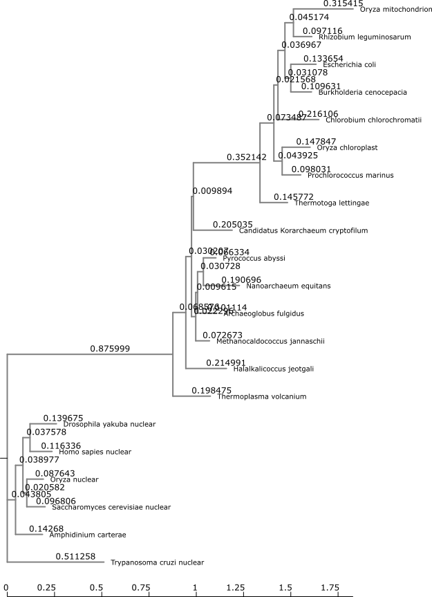

```{r, message=FALSE}
library(tidyverse)
library(ggtree)
library(treeio)
library(ggimage)
```

# Exercise

1. Use NGPhylogeny.fr to analysis the set of rRNA sequence provided. Describe the methods and put the.png file from your analysis into your Lab 8 .Rmd file


{width=25%}


3. Go through the tutorial on
Visualizing and Annotating Phylogenetic Trees with R+ggtree
(https://4va.github.io/biodatasci/r-ggtree.html)
adding the steps to your .Rmd file.

## Visualizing and Annotating PhylogeneticTrees with R+ggtree

Horizontal dimension- genetic change
branches- evolutionary lineages changing over time (longer the branch larger the change)
units- nucleotide substitutions per site

```{r}
tree <- read.tree("data/tree_newick.nwk")
tree

tree %>% ggplot()+
  geom_tree()+
  theme_tree()+
  labs(title="Plotting with ggplot")

tree %>% ggtree()+
  theme_tree2()+
  labs(title="Phylogram")

tree %>% ggtree(branch.length = "none") +labs(title= "Cladogram")

tree %>% ggtree(branch.length = "none", color="blue", size= 2, linetype=3) +
  labs(title= "Cladogram with aes")

```

## ** Exercise 1**

1. Create a slanted phylogenetic tree.
```{r}

tree %>% ggtree(layout = "slanted")+
  theme_tree2()
```
2. Create a circular phylogenetic tree
```{r}
tree %>% ggtree(layout = "circular")+
  theme_tree2()
```

3. Create a circular unscaled cladogram with thick red lines

```{r}
tree %>% ggtree(branch.length = "none", color="red", layout = "circular", linetype=1, size=1)
```

```{r}
p <- tree %>% ggtree()+
  geom_nodepoint()+
  geom_tippoint()+
  geom_tiplab()
print(p)
```
## ** Exercise 2**


```{r}
p <- tree %>% ggtree()+
  geom_nodepoint(alpha=0.5, size=2.5, color="orange")+
  geom_tippoint(shape=23, fill="red", color="red")+
  geom_tiplab(color= "purple")+
  ggtitle("Phylogenetic Aesthetics")
print(p)
```
## Internal Node Number

```{r}
tree %>% ggtree()+
  geom_text(aes(label=node), hjust=-.3)
```
Most recent common ancestor (MRCA)

Finding th emost recent common ancestor between C and E
```{r}
tree %>% ggtree()+
  geom_tiplab()

MRCA(tree, .node1="C",.node2 ="E")

MRCA(tree, .node1="G",.node2 ="H")


```
## Labeling Clades

Annotating the most recent common ancestor between taxa C and E
```{r}
tree %>% ggtree()+
  #geom_tiplab()+
   #geom_text(aes(label=node), hjust=-.3)+
  geom_cladelabel(node=17, label="Label for clade from node 17", color = "red")
```

```{r}
tree %>% ggtree()+
  geom_tiplab()+
   #geom_text(aes(label=node), hjust=-.3)+
  geom_cladelabel(node=17, label="Label for clade from node 17", color = "red", offset=1)
```

Adding another clade label connecting taxa G and H (node 21)

```{r}
tree %>% ggtree()+
  geom_tiplab()+
   #geom_text(aes(label=node), hjust=-.3)+
  geom_cladelabel(node=17, label="Label for clade from node 17", color = "red", offset=1, align=TRUE)+
  geom_cladelabel(node=21, label="Label for clade from node 17", color = "red", offset=1, align=TRUE)+
  theme_tree2()+
  xlim(0,70)+
  theme_tree()
  
```
##Highlighting a clade

```{r}
tree %>% ggtree()+
  geom_tiplab()+
  geom_highlight(node=17, fill="gold")+
  geom_highlight(node=21, fill="purple")
```

## Connecting Taxa

```{r}
tree %>% ggtree()+
  geom_tiplab()+
  geom_taxalink("E", "H", color="blue3")+
  geom_taxalink("C", "G", color="orange2", curvature=-.9)
```

## **Exercise 3**

First, find what the MRCA is for taxa B+C, and taxa L+J. You can do this in one of two ways:
Easiest: use MRCA(tree, tip=c("taxon1", "taxon2")) for B/C and L/J separately.

```{r}
BC_MRCA <-MRCA(tree, .node1="B", .node2 = "C")

print(paste("MRCA of BC = ", BC_MRCA))


LJ_MRCA <-MRCA(tree, .node1="L", .node2 = "J")

print(paste("MRCA of LJ = ", LJ_MRCA))

```


```{r}
tree %>% ggtree()+
  geom_tiplab()+
  geom_highlight(node = 19, fill ="gold")+
  geom_highlight(node = 23, fill ="skyblue")+
  geom_cladelabel(node=17,  label= "Superclade (node 17)", color= "gold", offset=0.8)+
  geom_taxalink("C", "E", color="grey", linetype=2)+
  geom_taxalink("G", "J", color="grey", linetype=2)+
  theme_tree2()+
  labs(title= " The phylogenetic tree for exercise 3")
  

```

# Advanced Tree Annotations

Plotting BEAST (Bayesian Evolutionary Analysis Sampling Trees) data

```{r, fig.width=10, fig.height= 20, fig.align='center'}
tree <- read.beast("data/flu_tree_beast.tree")

ggtree(tree, mrsd="2013-01-01")+
  theme_tree2()+
  geom_tiplab(align = TRUE, linesize =  0.5)+
  xlim(1990,2020)
```
# Putting multiple sequence alignment and phylogenetic tree side by side

```{r}
msaplot(p=ggtree(tree), fasta= "data/flu_aasequence.fasta", window= c(150, 175))
```


## Facet ggtree plots

```{r}
set.seed(42)
trees <- lapply(rep(c(10,25,50,100),3), rtree)
class(trees) <- "multiPhylo"

ggtree(trees) + 
  facet_wrap( ~.id, scale= "free", ncol=4)+
  ggtitle("Facet Phylogenetic Trees")
```


# Plotting tree with other data

```{r}
# Generating a random tree with 30 tips
tree <- rtree(30)


# Make the original plot
p <- ggtree(tree)

# Generating data for a 2nd plot
d1 <- data.frame(id=tree$tip.label, val=rnorm(30, sd=3))

# Making a second plot
p2 <- facet_plot(p, panel="dot", data=d1, geom=geom_point, aes(x=val), color='red3')


# Generating data for a 3rd plot
d2 <- data.frame(id=tree$tip.label, value = abs(rnorm(30, mean=100, sd=50)))


# Generating the third plot 
p3 <- facet_plot(p2, panel='bar', data=d2, geom=geom_segment, 
           aes(x=0, xend=value, y=y, yend=y), size=3, color='blue4') 


# Plotting all three with a scale

p3+ theme_tree2()

```

# Overlaying organism silouhettes


```{r}
newick <- "((Pongo_abelii,(Gorilla_gorilla_gorilla,(Pan_paniscus,Pan_troglodytes)Pan,Homo_sapiens)Homininae)Hominidae,Nomascus_leucogenys)Hominoidea;"


tree <- read.tree(text=newick)
d <- ggimage::phylopic_uid(tree$tip.label)

d$body_mass = c(52, 114, 47, 45, 58, 6)
  
p <- ggtree(tree) %<+% d + 
  geom_tiplab(aes(image=uid, colour=body_mass), geom="phylopic", offset=2.5) +
  geom_tiplab(aes(label=label), offset = .2) + xlim(NA, 7) +
  scale_color_viridis_c()
p  

```


4. Upload your tree file from the FastTreeMP output on CIPRES into R using treeio. Using ggtree to make the tree images, coloring the tree according to the domains of life.

```{r}
my_tree <- read.tree("data/Lab_8_fastree_result.tre")

ggtree(my_tree, layout = "circular", branch.length = "none")+
  #geom_nodelab()+
  geom_tiplab(hjust =-.1, size=3)+
  xlim(0, 36)+
  geom_highlight(node=30, fill ="gold", extend = 0.5)+
   geom_highlight(node=25, fill ="purple", extend = 0.5)+
  geom_highlight(node=36, fill ="skyblue", extend = 0.5)
```